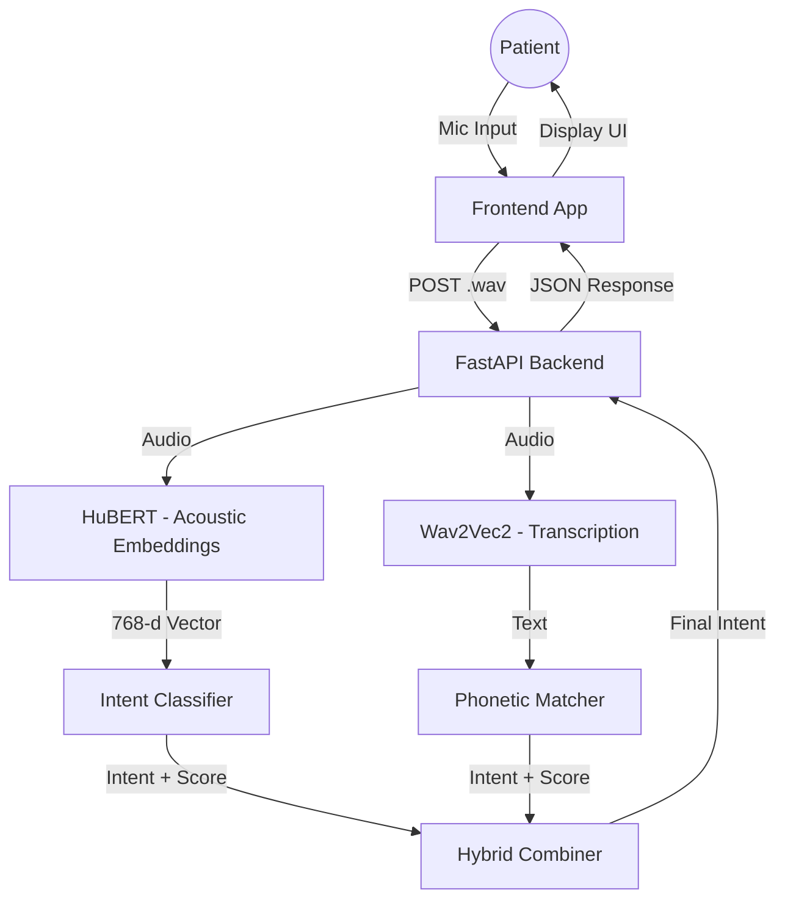

# 🏥 Patient Speech-to-Intent Backend

A specialized FastAPI backend designed for assistive patient care systems, **optimized for stroke/aphasia patients** with impaired speech. It processes voice commands (like "Help me", "Water", "Emergency") using a **hybrid classification system** that combines acoustic pattern recognition (HuBERT) with speech transcription (Wav2Vec2).

## 🌟 Key Features

- **Hybrid Speech-to-Intent Engine**: Combines HuBERT (acoustic embeddings) + Wav2Vec2 (transcription) for maximum accuracy with impaired speech
- **Advanced Embedding Classification**: Weighted K-Nearest Neighbors with centroid matching, optimized for varied aphasia speech patterns
- **Phonetic Matching**: Custom Soundex-like algorithm handles common aphasia speech patterns (consonant deletion, vowel substitution, slurred speech)
- **Fuzzy Pattern Matching**: Catches garbled transcriptions like `ALPE` → `HELP`, `wawa` → `WATER`
- **Confidence Calibration**: Realistic uncertainty estimates based on prediction margin and training data quality
- **Learning Loop**: System improves over time as caregivers confirm patient intents
- **Safety First**: High-confidence "EMERGENCY" triggers immediate alerts

---

## 🏗 System Architecture



### Classification Pipeline

1. **Audio Input**: Patient speaks into microphone (1-3 seconds)
2. **Model Processing**:
   - **HuBERT**: Extracts 768-dimensional audio embeddings (acoustic patterns)
   - **Wav2Vec2**: Produces text transcription
3. **Intent Classification**:
   - **Embedding-based**: Weighted KNN against stored reference samples
   - **Transcription-based**: Multi-stage phonetic + keyword matching
4. **Hybrid Combination**: Weighted fusion (60% HuBERT, 40% Wav2Vec)
5. **Confidence Calibration**: Adjusts based on margin and training data

---

## 📊 Supported Intents

| Intent | Description | Example Phrases (including aphasia variants) |
|--------|-------------|---------------------------------------------|
| HELP | General assistance | "help", "hep", "elp", "please" |
| WATER | Thirst/hydration | "water", "wawa", "thirsty" |
| YES | Affirmative | "yes", "ya", "yeh", "okay" |
| NO | Negative | "no", "nah", "stop" |
| PAIN | Discomfort | "pain", "ow", "hurts" |
| EMERGENCY | Urgent medical | "emergency", "doctor", "help now" |
| BATHROOM | Toileting | "bathroom", "potty", "pee" |
| TIRED | Rest/sleep | "tired", "sleep", "rest" |
| COLD | Temperature | "cold", "blanket", "freezing" |
| HOT | Temperature | "hot", "warm", "fan" |

---

## 🚀 Getting Started

### 1. Prerequisites
- Python 3.10 or higher
- Azure ML Endpoints deployed:
  - **HuBERT** (primary): For acoustic embeddings
  - **Wav2Vec2** (fallback): For transcription
- FFmpeg (optional, for audio conversion)

### 2. Installation
```bash
# Navigate to backend folder
cd Backend

# Create virtual environment
python -m venv venv

# Activate (Windows)
venv\Scripts\activate
# Activate (Mac/Linux)
source venv/bin/activate

# Install dependencies
pip install -r requirements.txt
```

### 3. Configuration
Create a `.env` file in the `Backend` folder:

```ini
# Azure ML Credentials
AZURE_ML_SCORING_URL=https://<your-endpoint>.inference.ml.azure.com/score
AZURE_ML_API_KEY=<your-primary-key>

# App Settings
HOST=127.0.0.1
PORT=8000
DEBUG=true
```

### 4. Running the Server
```bash
python -m uvicorn main:app --reload --host 127.0.0.1 --port 8000
```
Server will start at `http://127.0.0.1:8000`.

---

## 🧪 Testing with Audio

This backend requires specific audio formatting: **WAV, 16kHz, Mono, 16-bit**.

### Option A: Use Included Samples
We have provided 7 sample files in `Backend/Audio_files/`.
- `0001.wav` (Help)
- `0007.wav` (Care/Help)

Test using curl:
```bash
curl -X POST "http://127.0.0.1:8000/api/audio" \
  -H "accept: application/json" \
  -H "Content-Type: multipart/form-data" \
  -F "audio=@Backend/Audio_files/0001.wav;type=audio/wav"
```

### Option B: Generate Synthetic Data
We created a script to generate test files using Text-to-Speech.
```bash
# Install TTS dependencies
pip install pyttsx3 pydub soundfile numpy

# Run generator
python generate_data.py
```
This will create clean, 16kHz wav files in `Backend/Audio_files/Synthetic/`.

### Option C: Record Your Own
If recording manually, you **must** convert the file to the correct format using ffmpeg:
```bash
ffmpeg -i input_recording.mp3 -ac 1 -ar 16000 output_for_test.wav
```

---

## 📚 API Documentation

### `POST /api/audio`
Main endpoint for processing voice commands.

**Request:**
- `audio`: File (multipart/form-data), max 3 seconds, max 1MB.

**Response Example:**
```json
{
  "intent": "HELP",
  "confidence": 0.85,
  "status": "confirmed",
  "ui_options": ["Confirm Help", "Cancel"],
  "next_action": "await_user_confirmation",
  "transcription": "help me please"
}
```

### `GET /api/health`
Checks backend status and ML endpoint connectivity.

**Response:**
```json
{
  "status": "ok",
  "ml_endpoint": "reachable"
}
```

---

## 🔧 Troubleshooting

### "Transcription is garbage (ALPE, ULPE)"
**Cause:** The base Wav2Vec2 model often outputs raw phonemes if not fine-tuned on specific domain data.
**Solution:** This backend includes a **Regex Logic Layer** (`app/services/intent_logic.py`) that maps these known patterns (matches `ALPE`, `ULPE`, `CARE`) to `HELP`. **Do not worry about the garbage text; the intent will still be correct.**

### "422 Validation Error"
**Cause:** The uploaded file is likely MP3, M4A, or 44.1kHz WAV.
**Solution:** Ensure the file is **WAV** and **16000 Hz**.

### "503 Service Unavailable"
**Cause:** Cannot reach Azure ML.
**Solution:** Check if your container is running in Azure Studio or if the API Key is correct.
