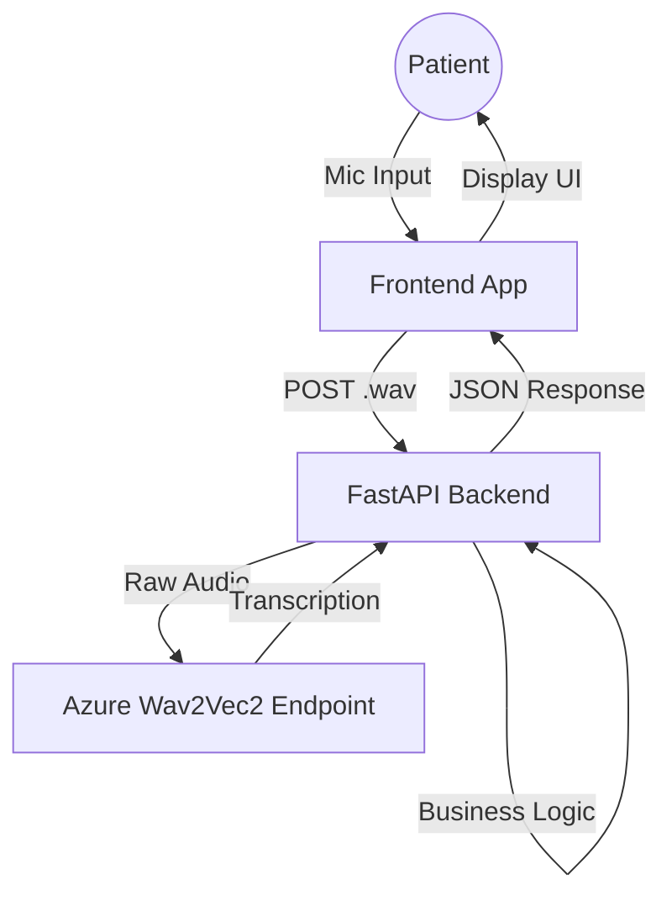

# 🏥 Patient Speech-to-Intent Backend

A specialized FastAPI backend designed for assistive patient care systems. It processes voice commands (like "Help me", "Water", "Emergency") by routing audio to an Azure ML `wav2vec2` endpoint and applying robust business logic to ensure safety and accuracy.

## 🌟 Key Features

- **Speech-to-Intent Engine**: Converts raw audio to structured intents (`HELP`, `EMERGENCY`, `WATER`, `YES`, `NO`).
- **Fuzzy Transcription Matching**: Automatically corrects garbled model outputs (e.g., maps `ALPE` → `HELP`) common with base Wav2Vec2 models.
- **Confidence Scoring**: Categorizes intents into `confirmed`, `needs_confirmation`, or `uncertain`.
- **Safety First**: High-confidence "EMERGENCY" creates an immediate trigger action.
- **Azure ML Integration**: Seamlessly connects to deployed inference endpoints.

---

## 🏗 System Architecture



---

## 🚀 Getting Started

### 1. Prerequisites
- Python 3.10 or higher
- An active Azure ML Endpoint (deployed with `wav2vec2-base-960h` or similar)
- FFmpeg (optional, for audio conversion)

### 2. Installation
```bash
# Navigate to backend folder
cd Backend

# Create virtual environment
python -m venv venv

# Activate (Windows)
venv\Scripts\activate
# Activate (Mac/Linux)
source venv/bin/activate

# Install dependencies
pip install -r requirements.txt
```

### 3. Configuration
Create a `.env` file in the `Backend` folder:

```ini
# Azure ML Credentials
AZURE_ML_SCORING_URL=https://<your-endpoint>.inference.ml.azure.com/score
AZURE_ML_API_KEY=<your-primary-key>

# App Settings
HOST=127.0.0.1
PORT=8000
DEBUG=true
```

### 4. Running the Server
```bash
python -m uvicorn main:app --reload --host 127.0.0.1 --port 8000
```
Server will start at `http://127.0.0.1:8000`.

---

## 🧪 Testing with Audio

This backend requires specific audio formatting: **WAV, 16kHz, Mono, 16-bit**.

### Option A: Use Included Samples
We have provided 7 sample files in `Backend/Audio_files/`.
- `0001.wav` (Help)
- `0007.wav` (Care/Help)

Test using curl:
```bash
curl -X POST "http://127.0.0.1:8000/api/audio" \
  -H "accept: application/json" \
  -H "Content-Type: multipart/form-data" \
  -F "audio=@Backend/Audio_files/0001.wav;type=audio/wav"
```

### Option B: Generate Synthetic Data
We created a script to generate test files using Text-to-Speech.
```bash
# Install TTS dependencies
pip install pyttsx3 pydub soundfile numpy

# Run generator
python generate_data.py
```
This will create clean, 16kHz wav files in `Backend/Audio_files/Synthetic/`.

### Option C: Record Your Own
If recording manually, you **must** convert the file to the correct format using ffmpeg:
```bash
ffmpeg -i input_recording.mp3 -ac 1 -ar 16000 output_for_test.wav
```

---

## 📚 API Documentation

### `POST /api/audio`
Main endpoint for processing voice commands.

**Request:**
- `audio`: File (multipart/form-data), max 3 seconds, max 1MB.

**Response Example:**
```json
{
  "intent": "HELP",
  "confidence": 0.85,
  "status": "confirmed",
  "ui_options": ["Confirm Help", "Cancel"],
  "next_action": "await_user_confirmation",
  "transcription": "help me please"
}
```

### `GET /api/health`
Checks backend status and ML endpoint connectivity.

**Response:**
```json
{
  "status": "ok",
  "ml_endpoint": "reachable"
}
```

---

## 🔧 Troubleshooting

### "Transcription is garbage (ALPE, ULPE)"
**Cause:** The base Wav2Vec2 model often outputs raw phonemes if not fine-tuned on specific domain data.
**Solution:** This backend includes a **Regex Logic Layer** (`app/services/intent_logic.py`) that maps these known patterns (matches `ALPE`, `ULPE`, `CARE`) to `HELP`. **Do not worry about the garbage text; the intent will still be correct.**

### "422 Validation Error"
**Cause:** The uploaded file is likely MP3, M4A, or 44.1kHz WAV.
**Solution:** Ensure the file is **WAV** and **16000 Hz**.

### "503 Service Unavailable"
**Cause:** Cannot reach Azure ML.
**Solution:** Check if your container is running in Azure Studio or if the API Key is correct.
